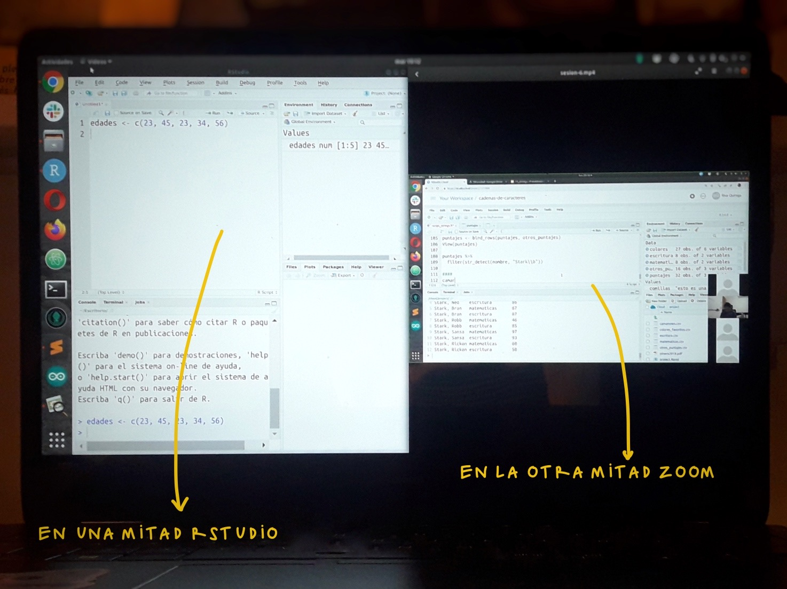

## Prepara tu espacio de trabajo

Este es un taller práctico en el que escribiremos "código en vivo", es decir, mostraremos todo el proceso de escritura y ejecución del código. Lo ideal es que vayas replicando en tu computador todo lo que hagamos. Para ello, es necesario que pienses en alguna configuración de pantalla que te permita ir mirando lo que hacemos en Zoom y replicándolo en RStudio.

A continuación hay algunas opciones:

### Una mitad de la pantalla para cada cosa

Es la opción más simple y no requieres nada más que tu computador.

### Una segunda pantalla

Esta es la opción más cómoda, pero no siempre es posible porque requieres más cosas que solo tu computador. Aquí van algunas ideas, en caso de que no tengas un segundo monitor.

#### Conectar tu computador a un televisor

Luego de conectarlo, configura tu computador para que las pantallas no se dupliquen, sino que veas dos cosas distintas en cada una. Así podrás trabajar en tu computador e ir mirando el taller en el televisor:

#### Usar otro dispositivo

Si tienes una tablet, puedes conectarte a Zoom desde ella para mirar el taller y en paralelo trabajar en tu computador. Puedes intentarlo también usando tu teléfono móvil, pero es posible que se vea demasiado pequeño el código. Si optas por esta opción, la sugerencia es que te conectes a Zoom **desde ambos dispositivos**. Así, si en algún momento del taller algo no te resulta, podrás compartir la pantalla para que podamos resolverlo.

